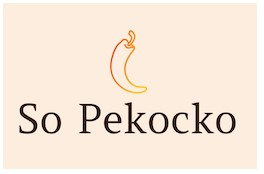

# Parcours Développeur Web - OpenClassrooms  
                            Projet n°6 - So Pekocko
## Construisez une API sécurisée pour une application d'avis gastronomiques

Ce projet est réalisé dans le cadre du parcours **Développeur Web** chez Openclassrooms.
Lien vers le site [OpenClassrooms](https://openclassrooms.com/fr/projects/676/assignment).

### Contexte du projet
So Pekocko est une entreprise familiale de 10 salariés. Son activité principale est la création de sauces piquantes dont la composition est tenue secrète. Forte de son succès, l’entreprise souhaite se développer et créer une application web, dans laquelle les utilisateurs pourront ajouter leurs sauces préférées et liker ou disliker les sauces proposées par les autres.

### Instructions relatives à l'API
* [Note de cadrage](Instructions/Cadrage.pdf)
* [Guidelines](Instructions/Guidelines.pdf)

### Contenus de ce repository
Ce répo contient les deux dossiers Frontend et Backend.
Vous pouvez cloner ce repository pour récupérer en local les deux parties Front et Back de l'application.

#### Faire tourner le Frontend
Le projet a été généré avec Angular CLI version 7.0.2.
Démarrer ng serve (ou npm start) pour avoir accès au serveur de développement. Rendez-vous sur http://localhost:4200/. L'application va se recharger automatiquement si vous modifiez un fichier source.

#### Faire tourner le Backend
Pour utiliser le serveur, chargez le package nodemon : npm install -g nodemon
Puis lancez le serveur: nodemon server.

### Technologies utilisées
* Framework : Express ;
* Serveur : NodeJS ;
* Base de données : MongoDB ;
* Toutes les opérations de la base de données doivent utilisent le pack Mongoose avec
des schémas de données stricts.

### Compétences évaluées
* Stocker des données de manière sécurisée
* Mettre en œuvre des opérations CRUD de manière sécurisée
* Implémenter un modèle logique de données conformément à la réglementation

